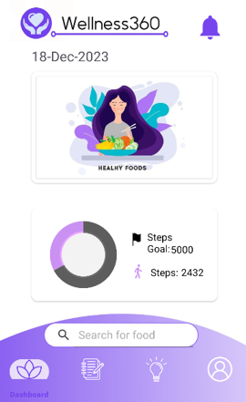
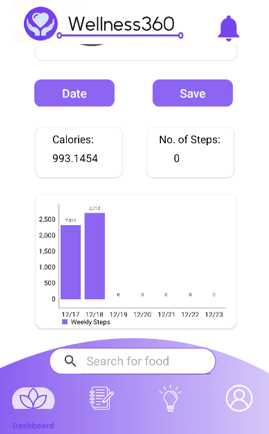
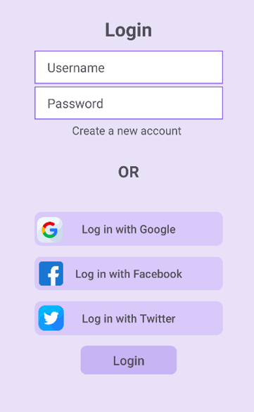
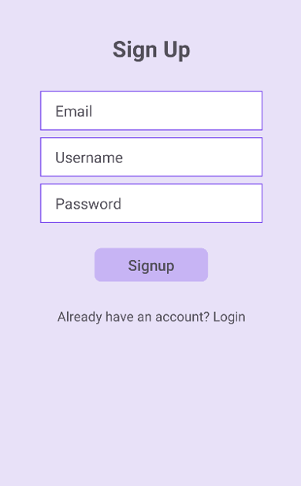
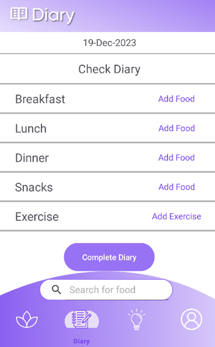
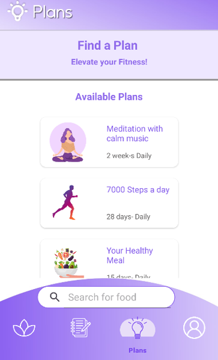
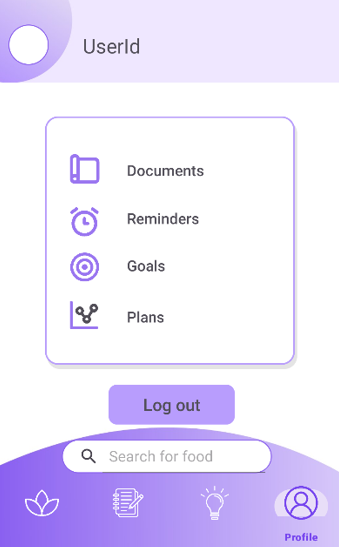
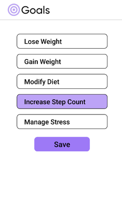

# 🌿 Wellness 360  

A comprehensive **HealthCare & Fitness application** designed to help users lead a healthier and more balanced lifestyle. Wellness 360 integrates **fitness tracking, nutrition management, stress reduction, and meditation support** into one platform, enabling users to adopt proactive habits for their overall well-being.  

---

## 📌 Objectives  

1. **Improve Lifestyle** – Provide features such as **fitness tracking**, **diet management**, and **stress reduction**.  
2. **Promote Healthy Habits** – Encourage users to adopt a **proactive approach** to their well-being through structured plans.  
3. **Track Progress Visually** – Offer **graphs and insights** to show user improvements and help set realistic goals.  

---

## ⚙️ Features  

- 🏃 **Fitness Tracking** – Monitor physical activity using **Google Fit API**.  
- 🥗 **Nutrition Guide** – Fetch diet/nutrition plans powered by the **Edamam API**.  
- 🧘 **Meditation & Stress Reduction** – Access meditation plans and stress management resources.  
- 📊 **Progress Visualization** – Charts and insights to measure user progress over time.  
- 🔐 **Authentication & Data Storage** – Powered by **Firebase** for secure login and cloud sync.  

---

## 🛠️ Tech Stack  

- **Frontend & Logic** – Java, XML (Android Native Development)  
- **Backend / Database** – Firebase Authentication & Realtime Database  
- **APIs Integrated**:  
  - [Edamam API](https://developer.edamam.com/) – Nutrition & diet data  
  - [Google Fit API](https://developers.google.com/fit) – Activity tracking  
- **Platform** – Android  

---

## 🚀 Installation & Setup  

1. Clone this repository:  
   ```bash
   git clone https://github.com/your-username/Wellness360.git
   cd Wellness360
   
2. Open the project in Android Studio.

3. Set up Firebase:

   Add your google-services.json file inside the /app directory.
   Enable Authentication and Realtime Database in Firebase Console.

4. Configure APIs:

   Generate API keys for Edamam and Google Fit.
   Add them in the project configuration files (strings.xml or constants).

5. Build and run on an emulator or Android device.

## Project Screenshots

### Splash Screen

<table>
  <tr>
    <td>
      
      <p align="center">Splash Screen</p>
    </td>
  </tr>
</table>

### Home Screen
This is the main home screen where users can see their dashboard and quick reads.

<table>
  <tr>
    <td>
      
      <p align="center">Home Screen</p>
    </td>
    <td>
      
      <p align="center">Dashboard</p>
    </td>
  </tr>
</table>


### Sign In and Sign Up Screens
The login screen allows users to authenticate using email and password or using Google/Twitter(X)/Facebook.
The sign up screen allows users to create a new account using username, email and password.

<table>
  <tr>
    <td>
      
      <p align="center">Login Screen</p>
    </td>
    <td>
      
      <p align="center">SignUp</p>
    </td>
  </tr>
</table>

### Diary Screen
Users can add food enteries to their daily diary.

<table>
  <tr>
    <td>
      
      <p align="center">Diary Screen</p>
    </td>
  </tr>
</table>

### Plans Screen
Users can choose and start any health plan.

<table>
  <tr>
    <td>
      
      <p align="center">Plans Screen</p>
    </td>
  </tr>
</table>

### Profile Screen and Goals section
Users can update their profile,and change settings.
Users can select any goal to achieve.

<table>
  <tr>
    <td>
      
      <p align="center">Profile Screen</p>
    </td>
     <td>
      
      <p align="center">Goals</p>
    </td>
  </tr>
</table>


